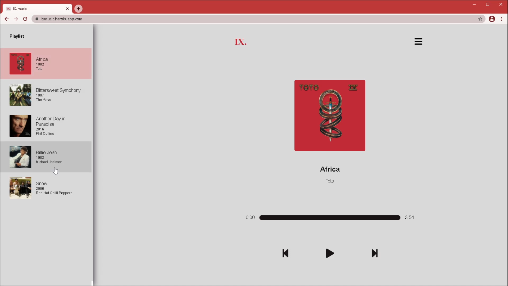

# IX music

 &nbsp;
<br/>

[Demo](https://www.ixmusic.thezajac.com/) &nbsp; &nbsp; &nbsp; [Repository](https://github.com/oliver-za/ixmusic)<br/>



**Description**<br />
🎼 Music player application with server served playlist stored in SQL database.

IXmusic is a fullstack application which enables users to play and listen to music.<br/>
Application utilizes the Node, Express, React, SQLite as a stack.<br/>

Frontend is built with React.<br/>
Backend is powered by Node and Express.<br/>
Application utilizes Rest API.<br/>
Information about every song such as Name, Artist and Year are located in SQL database SQLite.<br/>
Song images are fetched from Apple Music.<br/>
Backend uses dependency sqlite3 to connect and communicate with SQLite database.<br/>
Backend uses library Knex.js for SQL query building.<br/>
Items are being fetched on the frontend by axios library.<br/>
Frontend utilizes React Hooks.<br/>
Styling is done with SCSS.<br/>
Icons are provided by @fortawesome library.<br/>
Playlist is in form of an animated sidedrawer, animation is done with transform property.<br/>
Application is responsive and mobile-friendly.<br/>

<br />

## Table of content

- [Features](#features)
- [Motivation](#motivation)
- [**Installation**](#installation)
- [Built With](#built-with)
- [Ideas for future releases](#ideas-for-future-releases)
- [License](#license)
- [Contact](#contact)

<br/>

## Features

- Play songs
- Pause songs
- Change songs
- Song logo
- Basic song information
- Playlist
- Jump through a song by clicking the progress bar
- Responsive/mobile-friendly

<br/>

## Motivation

I wanted to build music application to practice Node, React, SQL and listen to some of my favorite music through an application. Setting up the player component and adding the playlist was fun experience. Anyway, I also hope you enjoyed the songs.

<br/>

## Getting Started

### Installation

To run application on your local machine follow these steps:

1. Clone or download the project from the [repository](https://github.com/oliver-za/ixmusic).
2. Install both backend and frontend dependencies with this one command:

   ```bash
   # with npm
   npm run iall

   # or with yarn
   yarn run iall
   ```

3. Start development mode with command:

   ```bash
   # with npm
   npm run dev

   # or with yarn
   yarn run dev
   ```

4. Run the application in the browser with url:
   ```javacript
   localhost:3000
   ```

<br />

## Built With

Frontend bootstrapped with create-react-app

**Backend dependencies**

- node
- express
- sqlite3
- knex
- body-parser
- compression

**Frontend dependenceis**

- react
- react-dom
- axios
- sass

<br/>

## Ideas for future releases

- Ability for users to add songs directly through the website
- User authentication
- Rating
- Favorite songs/Custom playlist
- Additional data about the song
- Artist profile

<br/>

## License

This project is licensed under the [MIT License](./LICENSE)

<br/>

## Contact

With any ideas or questions...

You can contact me via email: oliverzaj@gmail.com <br/>
Or fill the contact form at my [personal website](https://thezajac.com)
